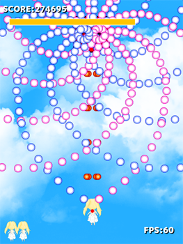

# がんばれ！あといちゃん
Siv3D + C++で制作した弾幕STG  
背伸びしてC++11を積極的に使っていたりします  

## ScreenShot

## License
MIT License

## Build
Siv3D(January 2015 v3) + VS2013 Update4でビルド出来るはずです。多分

## ビルドしたもの
は[ここ](https://www.dropbox.com/s/jh3ttlag6d6mj7i/GANBARE_ATOICHAN.zip)に置いてます
